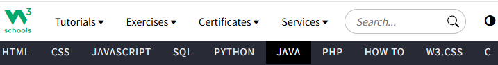
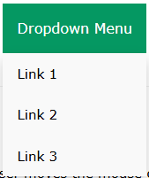

# **Aprofundando na Arquitetura da Informação: Menus e Navegação** 🔍

## 1. Introdução: O Papel dos Menus na Arquitetura da Informação

Na última aula, discutimos os conceitos fundamentais da **Arquitetura da Informação (AI)** e como ela impacta a experiência do usuário (UX). Hoje, vamos dar continuidade a esse assunto e explorar um dos aspectos mais importantes da **navegação**: os **menus**. Eles são como mapas que guiam os usuários pelo conteúdo do site ou aplicativo, ajudando-os a encontrar rapidamente o que precisam.

Os menus não são apenas uma questão de estética; sua estrutura e organização afetam diretamente a **eficiência** e **facilidade de navegação** de uma interface. Vamos entender como otimizar menus e navegação para garantir uma boa experiência de usuário.

## 2. O Que São Menus e Como Eles Funcionam? 🗂️

Os **menus** são elementos essenciais da arquitetura de navegação, geralmente compostos por uma lista de links ou opções. Eles permitem que os usuários escolham rapidamente onde querem ir dentro do site ou aplicativo.

### Tipos Comuns de Menus:
- **Menu Horizontal**: Normalmente encontrado na parte superior da página, com links para as principais seções.
  
  <figure style="text-align: center;">
    
     
    <figcaption>Fonte: https://www.w3schools.com/</figcaption>
  </figure>
  
- **Menu Vertical**: Geralmente à esquerda ou à direita da página, ideal para sites com muitas opções.

  <figure style="text-align: center;">
    
     
    <figcaption>Fonte: https://www.amazon.com.br/</figcaption>
  </figure>
  
- **Menus Suspensos (Dropdowns)**: Menus que se expandem quando o usuário passa o mouse sobre ou clica em um item, oferecendo mais opções sem sobrecarregar a tela.

  <figure style="text-align: center;">
    
     
    <figcaption>Fonte: https://www.w3schools.com/css/css_dropdowns.asp</figcaption>
  </figure>

- **Menus Hamburger**: Ícones que se expandem em um menu completo, usados principalmente em dispositivos móveis.

  <figure style="text-align: center;">
    
     
    <figcaption>Fonte: https://getbootstrap.com/docs/5.3/examples/navbars/</figcaption>
  </figure>

## 3. Menus Suspensos (Dropdowns): Quantas Opções são Ideais? 🎯

Os **menus suspensos** são uma ótima maneira de agrupar opções em uma única área, evitando que a tela fique sobrecarregada. No entanto, o **número de opções** em um menu suspenso é um fator importante a ser considerado, pois menus excessivamente longos ou complexos podem confundir o usuário.

### A Lei de Miller e a Limitação Cognitiva 📊

Para entender o número ideal de opções em um menu, precisamos considerar a **Lei de Miller**[^1], formulada por George Miller, psicólogo cognitivo, em 1956. Ele observou que a memória de trabalho humana tem uma capacidade limitada, podendo reter de forma eficiente apenas **7 (+/- 2)** itens simultaneamente. Isso significa que, quando um menu tem mais do que sete opções principais, o usuário pode se sentir sobrecarregado cognitivamente, o que pode resultar em uma navegação confusa e frustrante.

#### Exemplificando a Lei de Miller:
- Se um menu de navegação tem 10 itens, o cérebro do usuário pode ter dificuldade em processar todas essas opções ao mesmo tempo.
- Menus com **5 a 7 opções principais** são ideais, pois isso respeita a capacidade do cérebro de processar e tomar decisões rapidamente.

### Regras para Menus Suspensos Eficientes:
1. **Limite o número de opções**: A recomendação é que um menu suspenso tenha **entre 5 e 7 opções principais**. Esse é o número ideal para que o usuário consiga visualizar tudo de uma vez, sem se perder em um menu interminável.
   
   - **Por que?** Menus com muitas opções podem causar **sobrecarga cognitiva**, dificultando a tomada de decisões.

2. **Agrupe as opções de forma lógica**: Se o menu precisa de mais opções, agrupe-as em **subcategorias**. Isso mantém a estrutura organizada e evita menus muito longos.

   - **Exemplo**: No **Spotify**, o menu suspenso pode ter categorias como "Músicas", "Podcasts", "Álbuns" e "Playlists". Se o menu tiver muitas opções, ele pode se dividir em submenus, como "Músicas > Recentes", "Músicas > Gêneros", etc.

3. **Utilize hierarquia visual**: Diferencie as opções principais e secundárias com diferentes estilos de fonte, tamanhos ou cores. Isso torna a navegação mais intuitiva.

4. **Evite menus ocultos ou de difícil acesso**: Embora menus suspensos sejam muito úteis, eles devem ser **fáceis de acessar**. Se o menu precisar de muitos cliques ou movimentos complicados do mouse, o usuário pode se frustrar.

## 4. A Importância da Navegação em Camadas 🧭

Muitas vezes, um site ou app vai além de um único nível de navegação e exige menus mais complexos, com **submenus** ou **navegação em camadas**. Aqui, é crucial garantir que o usuário saiba exatamente onde está e como voltar.

### Como Gerenciar a Navegação em Camadas:
- **Breadcrumbs (Trilhas de Navegação)**: São as "trilhas" visíveis que mostram ao usuário o caminho que ele percorreu até o momento. Um exemplo é a linha de navegação do tipo: `Início > Produtos > Eletrônicos > Smartphones`. Isso permite que o usuário volte facilmente a qualquer parte da hierarquia.
  
- **Visibilidade das opções**: Quando se utiliza submenus, é importante que eles sejam **claro** e **visíveis**. Se as opções não são óbvias ou precisam de muitos cliques para revelar mais conteúdo, o usuário pode se perder.

## 5. Menus Responsivos: Ajustando para Diferentes Dispositivos 📱💻

Hoje em dia, as pessoas acessam a internet de diferentes dispositivos (desktop, tablets, smartphones). Por isso, a arquitetura de navegação precisa ser **responsiva**, ou seja, se ajustar de forma eficiente a qualquer tamanho de tela.

### Como Adaptar Menus para Dispositivos Móveis:
- **Menu Hamburger**: Ideal para smartphones, o menu hamburger é representado por um ícone de três linhas horizontais. Ao clicar, ele revela o menu completo.
  
- **Menus Fixos**: Em dispositivos móveis, os menus fixos na parte inferior da tela (bottom navigation) podem facilitar o acesso às funções mais usadas, como "Início", "Pesquisar", "Favoritos", etc.

- **Evite sobrecarregar os menus em telas pequenas**: Menus complexos com muitas opções podem ser difíceis de navegar em telas pequenas. Nesses casos, simplifique as categorias e use ícones sempre que possível.

## 6. Exemplos Reais de Menus Bem Estruturados ✅

1. **Apple** 🍏: O site da Apple utiliza menus horizontais e suspensos muito bem organizados. A navegação entre os produtos, como "iPhone", "Mac", "Apple Watch" e "AirPods", é clara, com submenus bem definidos para cada categoria de produtos.

2. **Airbnb** 🏠: O site do Airbnb usa um menu de navegação claro, com categorias principais (como "Destinos", "Hospedagens", "Experiências") e submenus que detalham as opções de forma acessível e intuitiva.

3. **Spotify** 🎶: O Spotify também tem menus suspensos eficientes, permitindo que os usuários naveguem rapidamente por músicas, playlists e artistas. Eles mantêm o número de opções baixo e agrupam funções relacionadas.

## 7. Exemplos de Menus Mal Estruturados ❌

1. **E-commerce com muitas categorias no menu** 🛍️: Alguns sites de e-commerce abusam de menus suspensos longos, com muitas opções agrupadas sem uma hierarquia clara. Isso pode ser confuso para os usuários e resultar em uma experiência de navegação ruim.

2. **Sites com menus complicados e difíceis de acessar** 🖥️: Alguns sites com navegação em camadas e menus escondidos podem ser desorientadores. Se o menu exigir muitos cliques para acessar o conteúdo principal, isso pode frustrar o usuário e afetar sua experiência.

## 8. Exercícios para Melhorar Menus e Navegação ✍️

**Exercício 1: Analisando Menus Suspensos**

- Escolha um site ou aplicativo e analise o menu suspenso. Pergunte-se:

  - O menu tem muitas opções?
  - As opções estão agrupadas de forma lógica?
  - O menu é fácil de acessar e utilizar?

**Exercício 2: Criando um Menu Responsivo no Figma**

- Imagine que você está criando um site de e-commerce. Usando o Figma, crie um layout de menu para desktop e um para celular, levando em consideração o número de opções, hierarquia e estrutura. Como você tornaria a navegação intuitiva em ambos os casos?

  - **Passo a Passo**:
  
    1. **No Figma**, crie dois quadros: um para a versão desktop e outro para a versão mobile.
    2. Adicione no desktop um menu horizontal com entre 5 e 7 opções.
    3. No mobile, use o conceito de **Menu Hamburger** ou **Bottom Navigation**.
    4. Teste diferentes hierarquias de agrupamento para ver qual oferece a melhor navegação.
    5. Use o **Prototype** do Figma para criar uma interação simples entre os menus.

**Exercício 3: Simulando um Menu Suspenso**

- Crie um protótipo simples de um menu suspenso no Figma. Adicione entre 5 e 7 opções e divida-as em submenus. Teste a fluidez da navegação e faça ajustes de design para garantir clareza.

## 9. Leitura Recomendada 📖

- **"Designing Interfaces"** de Jenifer Tidwell: Um excelente guia para criar interfaces de usuário eficientes, com muitos exemplos de menus e navegação.
  
- **"Mobile First"** de Luke Wroblewski: Livro focado em design para dispositivos móveis, com dicas práticas sobre como adaptar a navegação para telas pequenas.

## 10. Conclusão 🎯

A **navegação** bem estruturada e os **menus** eficientes são fundamentais para garantir uma boa experiência ao usuário. Menus suspensos, bem organizados e responsivos, com uma quantidade razoável de opções, podem tornar a interação com um site ou app muito mais intuitiva. Lembre-se: a simplicidade e clareza são a chave para uma navegação sem frustrações.

>[!TIP]  
> Ao criar um menu, tenha sempre em mente: **menos é mais**. Um número reduzido de opções bem organizadas é sempre melhor do que um menu sobrecarregado e confuso!

[^1]: MILLER, George A. *The magical number seven, plus or minus two: Some limits on our capacity for processing information*. Psychological Review, v. 63, n. 2, p. 81, 1956.
