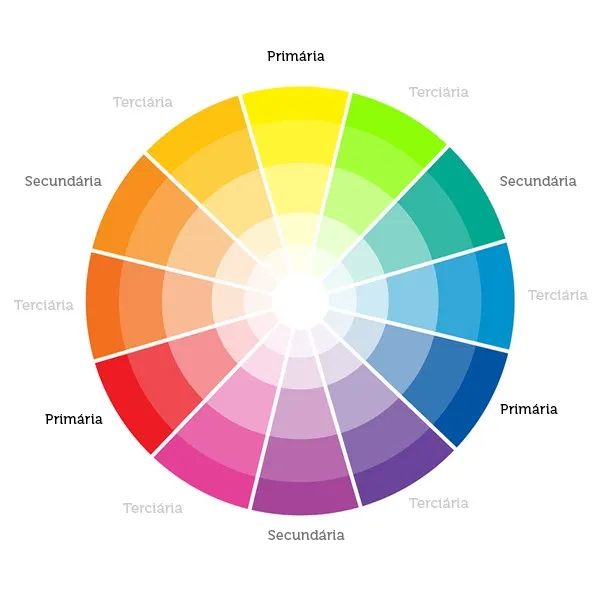
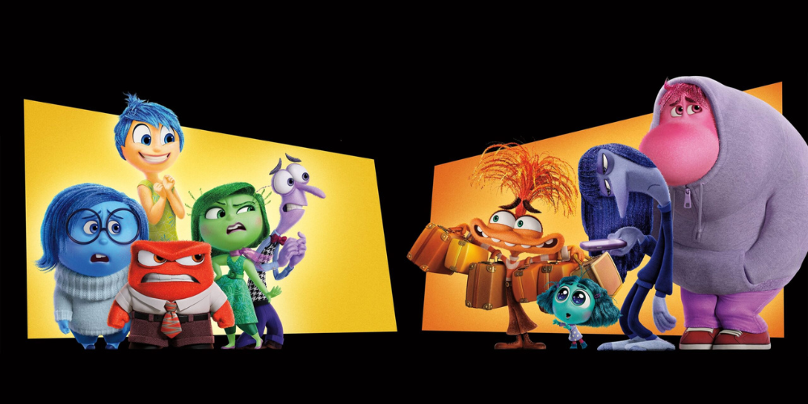
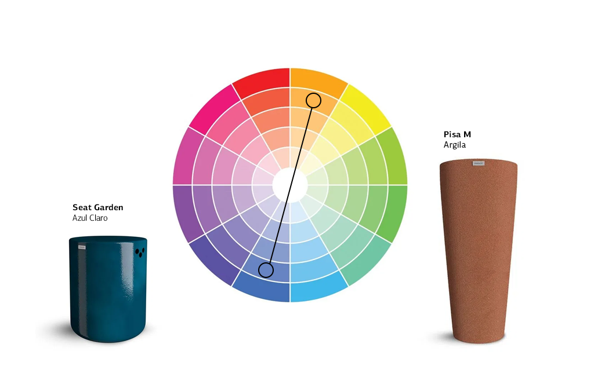
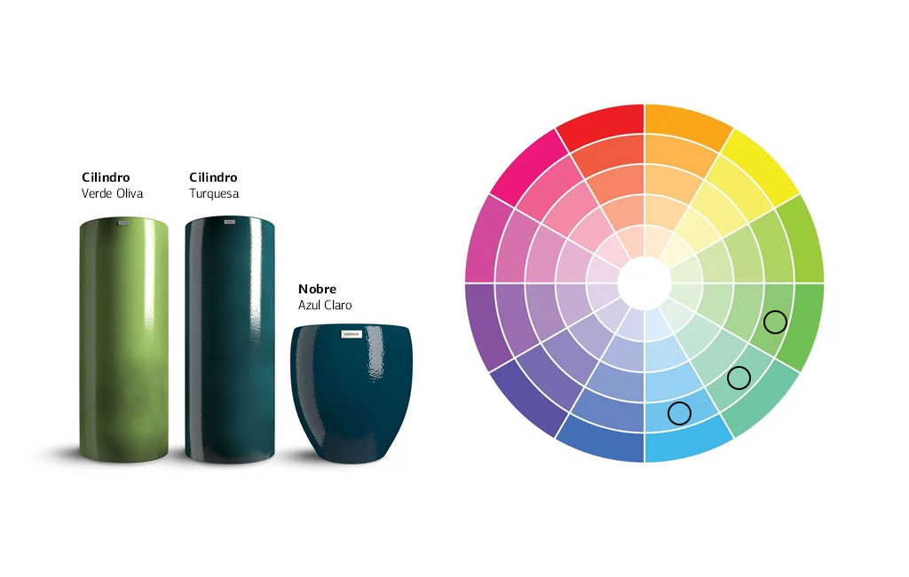
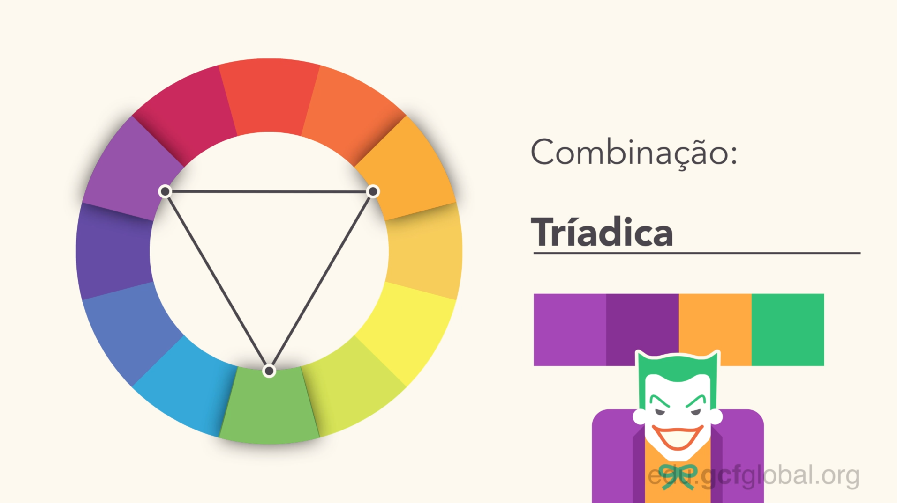
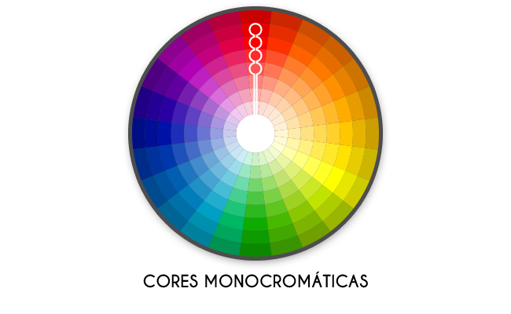

# **Teoria das Cores** 🎨

## 1. O Impacto das Cores na Experiência do Usuário

As **cores** têm um grande poder psicológico e visual no design, afetando como os usuários percebem a marca, a interface e até mesmo como interagem com o conteúdo. As escolhas de cor podem influenciar o humor, a percepção e até a tomada de decisões. Hoje, vamos explorar a teoria das cores e como aplicar as cores de forma estratégica em diferentes contextos de design.

## 2. Fundamentos da Teoria das Cores

A **teoria das cores** se baseia em como as cores interagem entre si, o que pode resultar em diferentes efeitos visuais e emocionais. Para entender isso melhor, é importante conhecer o **círculo cromático**, que é uma representação das cores organizadas de forma sequencial, ajudando a entender como elas se relacionam.

<figure style="text-align: center;">
  
  <figcaption>Fonte: https://www.colab55.com/collections/como-usar-o-circulo-cromatico-para-escolher-as-cores-na-decoracao</figcaption>
</figure>

### **Cores Primárias** 🌈

São as cores básicas que não podem ser feitas a partir de outras cores. Elas são a base para a criação de todas as outras cores.

- **Cores**: *Vermelho*, *Azul*, *Amarelo*.
- **Quando usar**:  
  - Em designs que necessitam de destaque ou impacto visual.

### **Cores Secundárias** 🌟

São criadas a partir da mistura das cores primárias.

- **Cores**: *Laranja*, *Verde*, *Roxo*.
- **Quando usar**:  
  - Para criar equilíbrio e suavidade em designs mais complexos.

### **Cores Terciárias** 🎯

São formadas pela mistura de uma cor primária com uma cor secundária.

- **Exemplos**: *Vermelho-alaranjado*, *Amarelo-esverdeado*, *Azul-arroxeado*.
- **Quando usar**:  
  - Para dar mais profundidade e variedade ao design, criando harmonia e sutileza.

---

## 3. Psicologia das Cores: Como as Cores Influenciam o Comportamento

Cada cor transmite diferentes significados e evoca emoções específicas. Ao escolher cores, é importante considerar o que elas representam no contexto cultural e psicológico do público-alvo.

<figure style="text-align: center;">
  
  <figcaption>Fonte: https://jornal.ufg.br/n/182681-especialistas-comentam-a-psicologia-de-divertida-mente-2
  </figcaption>
</figure>

### **Vermelho** 🔴

- **Significado**: Paixão, urgência, energia.
- **Usos**: Botões de ação, vendas, promoções, alertas.
- **Impacto psicológico**: A cor vermelha chama atenção rapidamente e pode aumentar o nível de excitação, sendo eficaz para criar um senso de urgência.

### **Azul** 🔵

- **Significado**: Confiança, calma, segurança.
- **Usos**: Bancos, empresas de tecnologia, designs corporativos.
- **Impacto psicológico**: O azul transmite tranquilidade e confiança, sendo muito utilizado em ambientes onde a credibilidade e seriedade são essenciais.

### **Verde** 🟢

- **Significado**: Crescimento, natureza, saúde.
- **Usos**: Organizações de saúde, sustentabilidade, ecologia.
- **Impacto psicológico**: O verde está associado à natureza e à tranquilidade, transmitindo equilíbrio e harmonia, além de estar ligado à sustentabilidade e saúde.

### **Amarelo** 🟡

- **Significado**: Alegria, otimismo, atenção.
- **Usos**: Campanhas publicitárias, designs criativos, atenção a detalhes importantes.
- **Impacto psicológico**: O amarelo é uma cor que estimula o pensamento e a criatividade, mas também pode causar ansiedade se usado em excesso.

### **Roxo** 🟣

- **Significado**: Luxo, criatividade, mistério.
- **Usos**: Marcas de luxo, designs artísticos, eventos especiais.
- **Impacto psicológico**: O roxo transmite uma sensação de nobreza e misticismo, sendo ideal para marcas que buscam criar um ar de sofisticação.

### **Preto** ⚫

- **Significado**: Sofisticação, poder, elegância.
- **Usos**: Marcas de luxo, elegância, simplicidade.
- **Impacto psicológico**: O preto é considerado uma cor forte, que transmite autoridade e elegância. Pode ser usado para dar um toque moderno ou clássico ao design.

### **Branco** ⚪

- **Significado**: Pureza, simplicidade, clareza.
- **Usos**: Espaços limpos, minimalismo, fundos de websites.
- **Impacto psicológico**: O branco traz uma sensação de espaço e simplicidade, sendo uma ótima opção para designs claros e arejados.

---

## 4. Harmonia das Cores: Como Combinar Cores de Forma Eficiente

### **Cores Complementares** ⚖️  
São aquelas que ficam opostas umas às outras no círculo cromático, criando contraste e impacto visual.

- **Exemplo**: Vermelho e verde, azul e laranja.
- **Quando usar**: Quando você quer criar um contraste marcante e atrair atenção para um elemento específico.

<figure style="text-align: center;">
  
  <figcaption>Fonte: https://blog.vasoecor.com.br/harmonia-de-cores-a-paleta-certa-para-o-seu-projeto/
  </figcaption>
</figure>

### **Cores Análogas** 🎨  
São cores que ficam lado a lado no círculo cromático, criando uma paleta harmônica e suave.

- **Exemplo**: Azul, azul-esverdeado e verde.
- **Quando usar**: Em designs mais tranquilos e harmoniosos, onde a suavidade é desejada.

<figure style="text-align: center;">
  
  <figcaption>Fonte: https://blog.vasoecor.com.br/harmonia-de-cores-a-paleta-certa-para-o-seu-projeto/
  </figcaption>
</figure>

### **Cores Triádicas** 🎯  
São três cores igualmente espaçadas no círculo cromático, criando uma paleta equilibrada e vibrante.

- **Exemplo**: Vermelho, amarelo e azul.
- **Quando usar**: Quando você deseja criar um design equilibrado e dinâmico.

<figure style="text-align: center;">
  
  <figcaption>Fonte: https://edu.gcfglobal.org/pt/conceitos-basicos-de-design-grafico/teoria-das-cores/1/
  </figcaption>
</figure>

### **Cores Monocromáticas** 🖤  
Usam variações de uma única cor, criando um design mais coeso e simples.

- **Exemplo**: Diferentes tons de azul.
- **Quando usar**: Para designs minimalistas ou quando a uniformidade é importante.

<figure style="text-align: center;">
  
  <figcaption>Fonte: https://blog.cartoesmaisbarato.com.br/psicologia-das-cores-qual-e-melhor-forma-de-aplicar-no-seu-material-grafico/10-cores-monocromaticas/
  </figcaption>
</figure>

---

## 5. Cores no Design Digital: Como Aplicá-las de Forma Adequada

### **Contraste de Cores** ⚫⚪

A legibilidade do texto depende do contraste adequado entre o texto e o fundo. Evite cores que se confundem, como texto amarelo sobre fundo branco. Busque sempre um bom contraste para garantir que o conteúdo seja facilmente lido.

### **Acessibilidade e Cores** ♿

Considerar o daltonismo e outras deficiências visuais é fundamental no design. Ferramentas como **contrast checkers** podem garantir que suas escolhas de cor atendam aos requisitos de acessibilidade.

### **Paletas de Cores para Web** 🌐

Escolha paletas de cores harmônicas e equilibradas para facilitar a navegação. As paletas mais populares incluem tons pastel, combinações de cores neutras, e cores complementares para destacar botões e chamadas à ação.

---

## 6. Exercícios para Prática

**Exercício 1: Analisando o Uso de Cores**

Escolha três sites ou apps e analise como as cores são usadas. Pergunte-se:

- As cores são adequadas ao propósito e à marca?
- Como as cores influenciam a experiência do usuário?
- O contraste é suficiente para garantir legibilidade?

**Exercício 2: Criando uma Paleta de Cores no Figma**
 
Crie uma paleta de cores para um site fictício de uma marca, levando em conta o contexto, público-alvo e objetivo do site. Experimente combinar cores complementares, análogas ou triádicas para ver qual combinação funciona melhor para seu design.

---

## 7. Leitura Recomendada 📖

- **"The Interaction of Color"** de Josef Albers: Um clássico sobre como as cores interagem e influenciam a percepção.
- **"Color Theory for Designers"** de Christina Lee: Um guia prático para aplicar a teoria das cores no design gráfico.
- **"Designing with Color"** de Samara D. Mattila: Um recurso útil para aprender a usar as cores de forma eficaz em diversos tipos de mídia.

---

## 8. Conclusão: O Poder das Cores no Design

A escolha das cores não é apenas uma questão estética, mas uma decisão estratégica que afeta a percepção e a usabilidade de um design. Ao entender a teoria das cores e como aplicar as cores de forma eficaz, você pode criar designs mais atraentes, funcionais e que ressoem com seu público. Lembre-se de considerar sempre o contexto, a emoção que deseja evocar e a clareza visual ao escolher sua paleta de cores!
