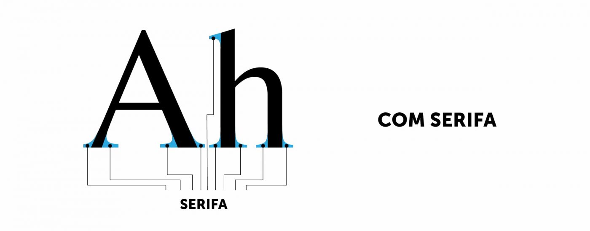
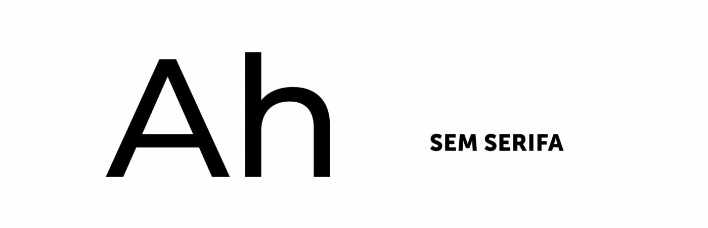
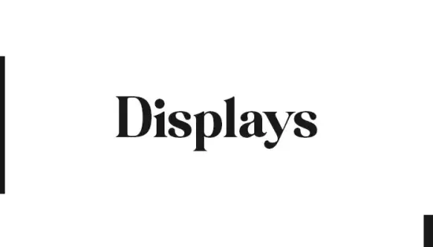

# **Tipografia: Usando Fontes de Forma Eficiente** 🅰️

## 1. O Poder da Tipografia na Experiência do Usuário

A **tipografia** é um dos pilares do design visual, impactando diretamente a legibilidade, o tom e a personalidade de uma marca ou interface. A escolha certa de fontes pode melhorar a compreensão, facilitar a navegação e transmitir a mensagem de forma mais eficaz. Hoje, vamos explorar os diferentes tipos de fontes e como usá-las adequadamente em diferentes plataformas e contextos.

## 2. Tipos de Fontes: Com e Sem Serifa, Fontes Display, e Outras

### **Fontes com Serifa** (Serif Fonts) 🧐  
As fontes com serifa têm pequenos "pés" ou "caudas" nas extremidades das letras. Elas são frequentemente vistas como mais formais e tradicionais, além de ajudarem na leitura em blocos de texto grandes, como em livros ou jornais.

- **Exemplos**: *Times New Roman*, *Georgia*, *Garamond*.
- **Quando usar**:  
  - **Impressos**: Jornais, livros, revistas, materiais acadêmicos.
  - **Web**: Ideal para textos longos e artigos.

<figure style="text-align: center;">
  
  <figcaption>Fonte: https://webnial.pt/blog/qual-a-diferenca-entre-tipos-de-letra-com-serifa-e-sem-serifa/</figcaption>
</figure>

### **Fontes Sem Serifa** (Sans-Serif Fonts) 🖥️  
As fontes sem serifa são mais limpas e modernas, com linhas retas e sem os "pés" ou "caudas". Elas são amplamente usadas em interfaces digitais devido à sua clareza e legibilidade em telas.

- **Exemplos**: *Arial*, *Helvetica*, *Open Sans*, *Roboto*.
- **Quando usar**:  
  - **Web e mobile**: Texto de navegação, menus, botões, e conteúdo digital.
  - **Impressos**: Para designs mais modernos ou materiais corporativos.

<figure style="text-align: center;">
  
  <figcaption>Fonte: https://webnial.pt/blog/qual-a-diferenca-entre-tipos-de-letra-com-serifa-e-sem-serifa/</figcaption>
</figure>

### **Fontes Display** 🖋️  
Essas fontes são geralmente decorativas, projetadas para chamar a atenção. Elas são ideais para títulos, logotipos ou designs criativos, mas devem ser usadas com moderação.

- **Exemplos**: *Impact*, *Lobster*, *Bangers*.
- **Quando usar**:  
  - **Títulos e Cabeçalhos**: Sites criativos, cartazes, material promocional.
  - **Evite usar em grandes blocos de texto**, pois podem prejudicar a legibilidade.

<figure style="text-align: center;">
  
  <figcaption>Fonte: https://designerdoreino.com/estilo-de-tipografia-display/</figcaption>
</figure>

### **Fontes Monoespaçadas** (Monospaced Fonts) ⌨️  
Essas fontes têm espaçamento fixo entre todas as letras, o que pode ser útil para codificação ou exibição de dados.

- **Exemplos**: *Courier New*, *Consolas*.
- **Quando usar**:  
  - **Programação**: Para destacar código ou texto técnico.

---

## 3. Tipos de Aplicação e A Escolha Adequada de Fontes

### **Web** 🌐  
- **Fontes mais comuns**: *Roboto*, *Open Sans*, *Arial*.
- **Recomendação**: Escolha fontes **sans-serif**, pois são mais legíveis em telas de diferentes tamanhos e resoluções. Mantenha a quantidade de fontes limitada para evitar sobrecarga visual (geralmente, 2 fontes: uma para títulos e outra para corpo de texto).
- **Tamanho de fonte**:  
  - **Corpo de texto**: Entre 16px e 18px para legibilidade.
  - **Títulos**: De 24px a 48px, dependendo do contexto e hierarquia.

### **Mobile** 📱  
- **Fontes mais comuns**: *Roboto*, *San Francisco* (para iOS), *Open Sans*.
- **Recomendação**: Usar fontes **sans-serif**, pois elas oferecem uma leitura mais rápida e fluida. Textos devem ser grandes o suficiente para leitura em dispositivos pequenos.
- **Tamanho de fonte**:  
  - **Corpo de texto**: De 14px a 16px.
  - **Títulos**: Variando de 22px a 32px, dependendo da importância.
  
### **Desktop** 💻  
- **Fontes mais comuns**: *Helvetica*, *Georgia*, *Times New Roman*.
- **Recomendação**: Fontes **serifadas** podem ser mais usadas em artigos longos, mas fontes **sans-serif** também são muito eficientes, especialmente para interfaces digitais. Para design de sites e aplicativos, priorize a legibilidade e o conforto visual.
- **Tamanho de fonte**:  
  - **Corpo de texto**: 16px a 18px.
  - **Títulos**: 24px a 36px.

### **Mídias Impressas (Revistas, Jornais, Panfletos, etc.)** 📚📰  
- **Fontes mais comuns**: *Times New Roman*, *Georgia*, *Helvetica*, *Baskerville*.
- **Recomendação**: Use fontes **serifadas** para artigos longos e fontes **sans-serif** para títulos e seções de destaque.
- **Tamanho de fonte**:  
  - **Corpo de texto**: Entre 10pt e 12pt.
  - **Títulos**: 18pt a 48pt, dependendo da hierarquia e do design.

### **Marketing Impresso e Material Promocional** 🎨  
- **Fontes mais comuns**: *Impact*, *Bebas Neue*, *Lobster*.
- **Recomendação**: Fontes **display** e **sans-serif** funcionam bem para captar atenção rapidamente em materiais como cartazes, flyers e panfletos.
- **Tamanho de fonte**:  
  - **Corpo de texto**: 12pt a 14pt.
  - **Títulos e chamadas**: 24pt a 72pt, dependendo da importância.

---

## 4. Fatores a Considerar ao Escolher uma Fonte

- **Legibilidade**: A principal preocupação deve ser a facilidade de leitura. Fontes muito decorativas ou com formas complexas podem ser difíceis de ler, especialmente em tamanhos pequenos.
- **Tom e Estilo**: A fonte deve refletir a **personalidade** do conteúdo. Por exemplo, fontes **serifadas** são ideais para um tom mais formal e tradicional, enquanto **sans-serif** traz um tom mais moderno e amigável.
- **Contraste**: Certifique-se de que o texto tenha **contraste adequado** com o fundo para garantir que seja legível. Evite cores muito semelhantes.
- **Consistência**: Mantenha consistência no uso de fontes. Limite o número de fontes diferentes em um único projeto, geralmente não mais do que duas ou três.

---

## 5. Tamanhos de Fonte: Como Definir a Hierarquia

A hierarquia tipográfica é crucial para guiar o usuário e ajudá-lo a compreender a estrutura do conteúdo. Ao determinar os tamanhos de fonte, considere a seguinte ordem:

- **Título Principal**: 32px a 48px (para impacto).
- **Subtítulos**: 24px a 30px (para criar distinção).
- **Texto de Corpo**: 16px a 18px (para legibilidade).
- **Legendas e Notas**: 12px a 14px (para detalhes).

Lembre-se sempre de testar o design em diferentes dispositivos para garantir que o tamanho da fonte seja adequado e legível.

---

## 6. Fontes Mais Utilizadas no Design Digital e Impressos

### **Fontes para Web e Digital**:
- **Google Fonts**: *Roboto*, *Open Sans*, *Lato*, *Montserrat*.
- **Adobe Fonts**: *Source Sans Pro*, *Proxima Nova*, *Futura*.

### **Fontes para Impressos**:
- **Serifadas**: *Times New Roman*, *Georgia*, *Miller*.
- **Sans-Serif**: *Helvetica*, *Arial*, *Roboto*.

---

## 7. Exercícios para Prática

**Exercício 1: Analisando o Uso de Fontes**  
Escolha três sites ou materiais impressos (livros, revistas, jornais, etc.) e analise o uso da tipografia. Pergunte-se:
- Qual fonte foi escolhida e por quê?
- A fonte é legível e adequada ao contexto?
- A hierarquia tipográfica está clara?

**Exercício 2: Criação de Hierarquia Tipográfica no Figma**

No Figma, crie um layout de página de um site com pelo menos dois títulos e corpo de texto. Teste diferentes combinações de fontes e tamanhos para garantir que a hierarquia e legibilidade estejam bem definidas.

---

## 8. Leitura Recomendada 📖

- **"The Elements of Typographic Style"** de Robert Bringhurst: Um dos melhores livros sobre o uso de tipografia, que combina história e teoria com dicas práticas.
- **"Thinking with Type"** de Ellen Lupton: Um guia visual que explora o design tipográfico de uma maneira acessível e prática.
- **"Type on Screen"** de Ellen Lupton: Um excelente recurso sobre a aplicação de tipografia no design digital.

---

## 9. Conclusão: O Impacto da Tipografia no Design

A escolha da tipografia é uma das decisões mais importantes no design, pois ela afeta diretamente a legibilidade e a experiência do usuário. Ao entender os diferentes tipos de fontes e como usá-las corretamente em diferentes contextos, você pode criar designs mais eficazes e agradáveis. Lembre-se sempre de equilibrar **estilo** e **funcionalidade** para garantir que a mensagem chegue ao seu público da melhor forma possível!
